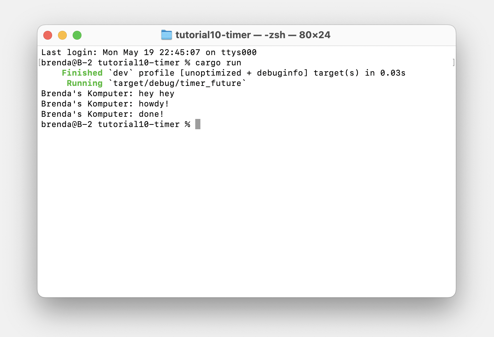
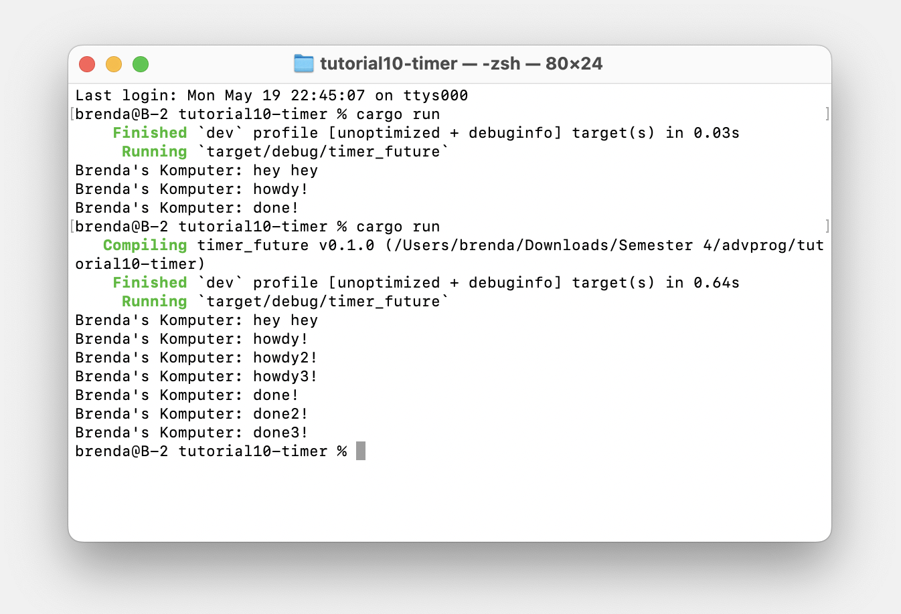
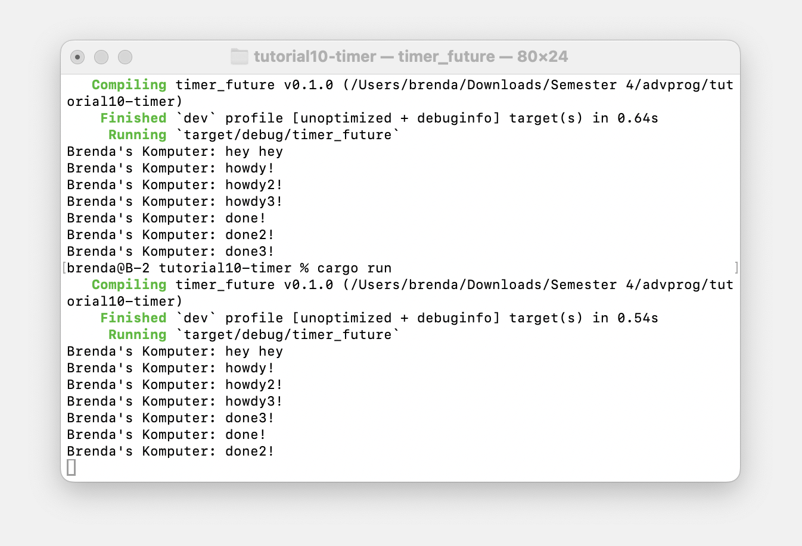

# Modul 10 Pemrograman Lanjut : Asynchronous Programming
oleh **Brenda Po Lok Fahida**

 
 

## Experiment 1.2: Understanding how it works.

 

Setelah menambahkan baris `println!("Brenda's Komputer: hey hey");` tepat setelah pemanggilan `spawner.spawn(...)`, hasil yang muncul saat program dijalankan menunjukkan bahwa kalimat "Brenda's Komputer: hey hey" dicetak terlebih dahulu, kemudian diikuti oleh "Brenda's Komputer: howdy!" dan, setelah dua detik, "Brenda's Komputer: done!". Hal ini terjadi karena `spawner.spawn(...)` tidak langsung menjalankan tugas yang diberikan, melainkan hanya mendaftarkan tugas tersebut ke dalam antrean executor. Karena proses tersebut bersifat non-blocking, eksekusi program langsung berlanjut ke baris berikutnya dan mencetak "hey hey". Barulah setelah `executor.run()` dijalankan, executor mulai menjalankan task yang telah di-*spawn*, yang mencetak "howdy!", menunggu selama dua detik menggunakan `TimerFuture`, dan kemudian mencetak "done!". Ini menunjukkan bagaimana tugas asynchronous berjalan secara independen dan executor-lah yang mengatur kapan tugas-tugas tersebut dijalankan.

## Experiment 1.3: Multiple Spawn and removing drop

**Multiple spawn:**

 

Setelah menambahkan tiga `spawn` dengan isi yang berbeda, hasil eksekusi menampilkan urutan `"hey hey"`, lalu `"howdy!"`, `"howdy2!"`, dan `"howdy3!"`, kemudian diikuti oleh `"done!"`, `"done2!"`, dan `"done3!"`. Hal ini menunjukkan bahwa ketiga tugas asynchronous berhasil dijadwalkan dan dijalankan bersamaan oleh executor. Urutan bagian `"howdy..."` muncul lebih dahulu karena berada sebelum `await`, sedangkan bagian `"done..."` muncul setelah delay dua detik, dan selesai sesuai antrean eksekusi. Saat `drop(spawner)` **dipanggil**, executor mengetahui bahwa tidak ada lagi tugas yang akan masuk, sehingga ia bisa menjalankan semua task sampai selesai sebelum menghentikan dirinya.

 

**Removing `drop(spawner);` statement:**

 

Namun, saat `drop(spawner)` **dihapus**, perilaku sedikit berubah. Meskipun ketiga task tetap dimulai, hasil akhir menunjukkan `"done3!"` muncul lebih awal dari `"done!"` dan `"done2!"`, menandakan bahwa tanpa `drop(spawner)`, executor tidak tahu bahwa tidak ada lagi task yang akan masuk, sehingga ia bisa berhenti lebih cepat atau menyelesaikan task dalam urutan yang sedikit berbeda. Ini menunjukkan pentingnya `drop(spawner)` untuk memberitahu executor agar terus memproses hingga semua task yang telah *spawned* benar-benar selesai (bukan hanya sebagian) dan akhirnya mengakhiri program.
